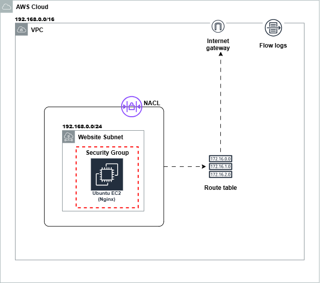
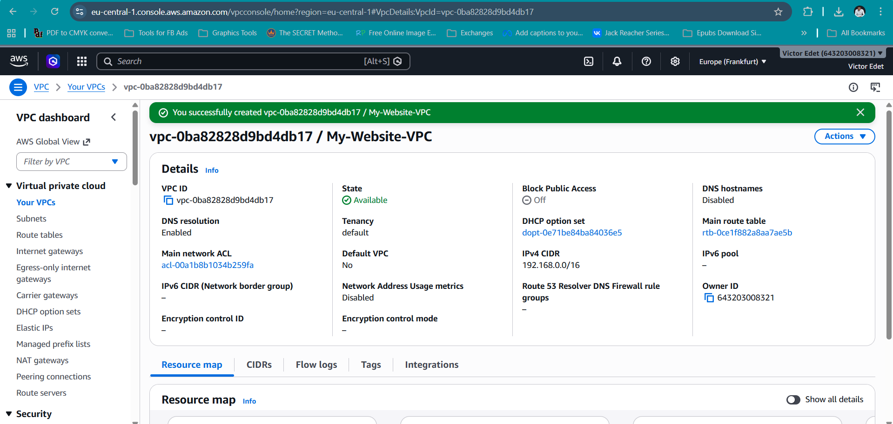
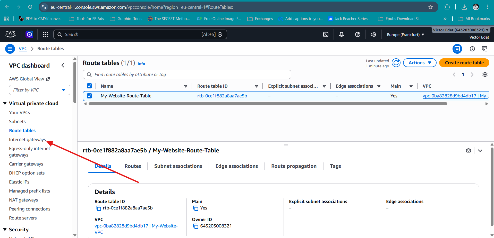
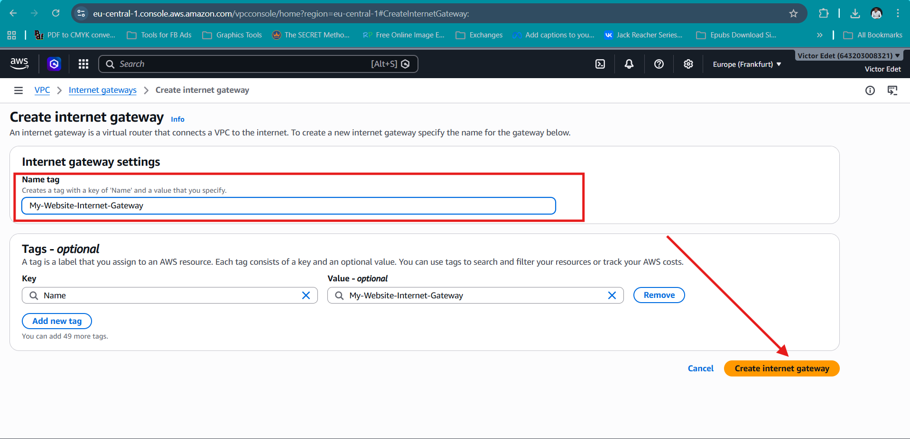
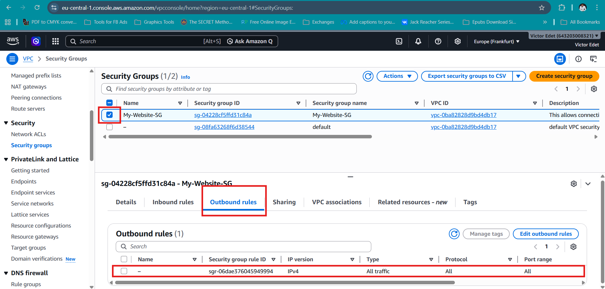
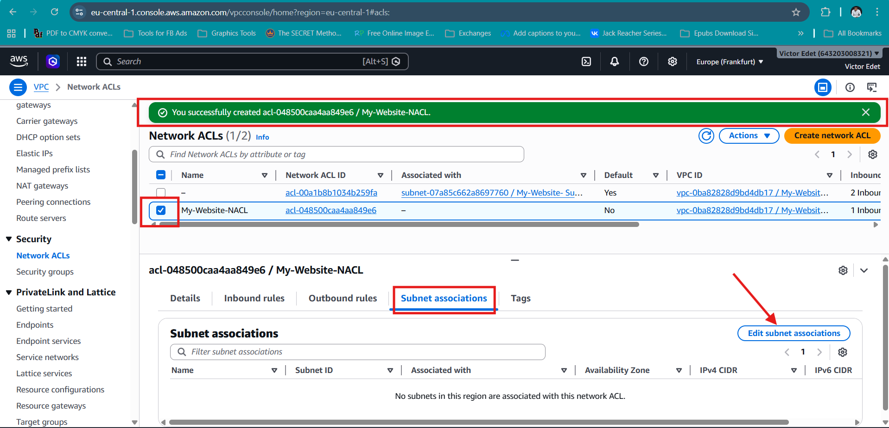
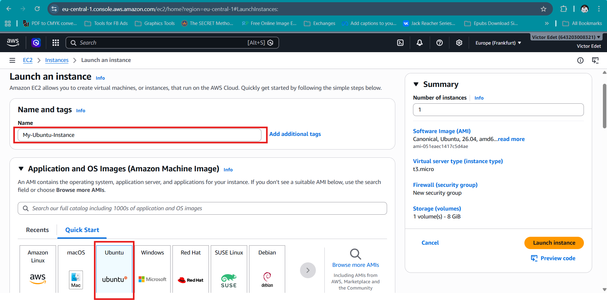
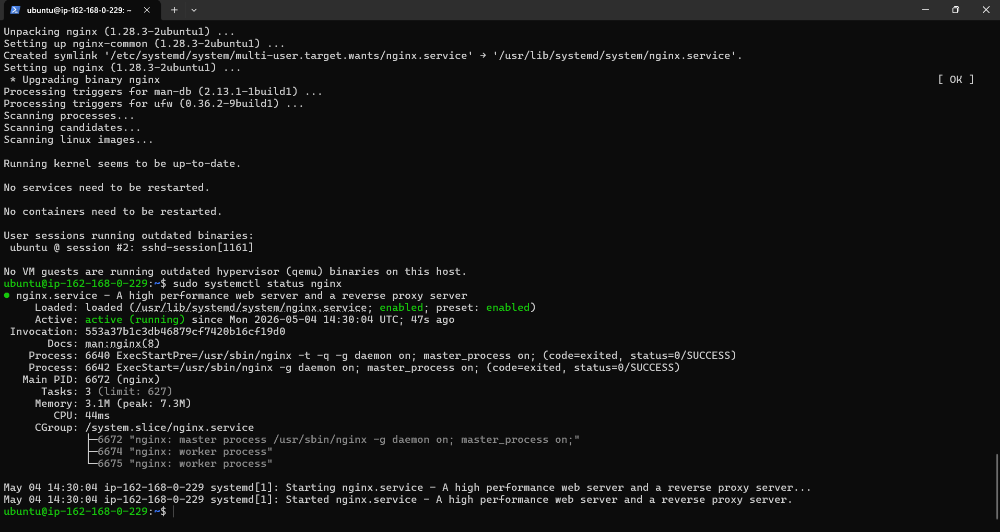
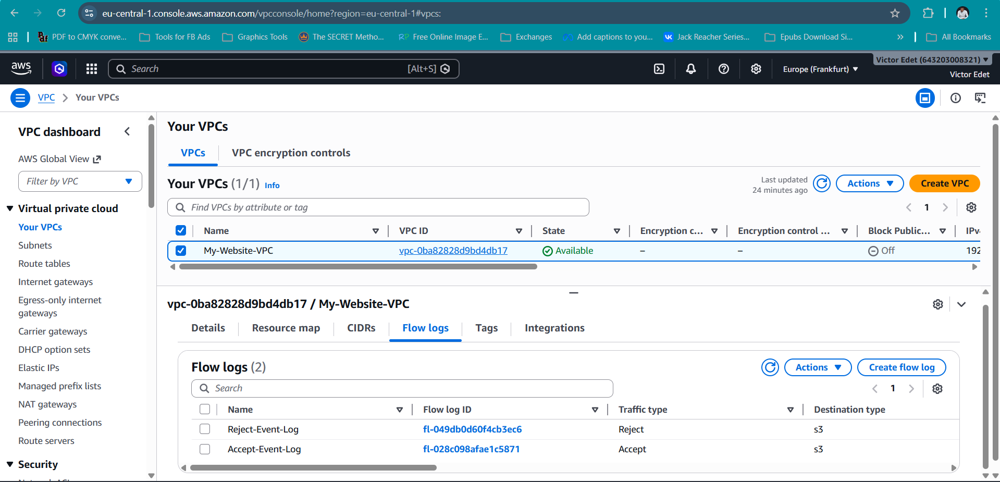

# AWS Static Website Hosting (EC2 & Custom VPC)

## Overview
In this project, I deployed a static website on Amazon Web Services using Amazon EC2 within a custom Amazon VPC.

I intentionally avoided managed services like S3 for hosting. The goal wasn’t just to get a website online, but to understand how the underlying infrastructure actually works - how traffic flows, how access is controlled, and how different layers interact when something breaks.

## Architecture



The setup includes:
- Custom VPC (`My-Website-VPC`)
- Public Subnet (`My-Website-Subnet`)
- Internet Gateway (`My-Website-Internet-Gateway`)
- Route Table (`My-Website-Route-Table`)
- Network ACL (`My-Website-NACL`)
- Security Group (`My-Website-SG`)
- EC2 Instance (`My-Ubuntu-Instance`)
- Nginx Web Server

## Request Flow
This is how a request moves through the system:
`User >>> DNS (victoredet.online) >>> Internet >>> Internet Gateway >>> Route Table >>> Public Subnet >>> EC2 Instance >>> Nginx >>> Response`
- DNS resolves the domain to the EC2 public IP
- Internet Gateway enables external communication with the VPC
- Route Table determines whether traffic is allowed to reach the subnet
- Network ACL (Subnet level) filters traffic before it reaches the instance
- Security Group (Instance level) allows or denies traffic to the EC2 instance
- Nginx serves the requested content
If any of these layers are misconfigured, the request fails.

## Design Decisions
Using EC2 for static hosting is not optimal in production. However, I chose it intentionally to understand how servers are configured from scratch, work directly with networking components (VPC, routing, access control), and see how a web server handles requests at the OS level.

## Infrastructure Setup

### VPC and Subnet
I created a custom VPC with CIDR `192.168.0.0/16`, along with a public subnet (`192.168.0.0/24`) to host the EC2 instance.



### Routing and Internet Access
I attached an Internet Gateway, and configured a route (`0.0.0.0/0`) to allow internet traffic.





### Security Configuration
I setup adnd configured Security Group with SSH (Port 22) restricted to my IP and HTTP (Port 80) open to public.



### Network ACL
I later setup NACL and configured Rule 110 to allow HTTP (Port 80). Rule 120 was configured to allow SSH (Port 22) from my IP. This added subnet-level traffic control on top of the security group. Security Groups and NACLs operate at different layers. NACLs evaluate traffic at the subnet level, while Security Groups evaluate traffic at the instance level. A misalignment between the two can block traffic even if one layer allows it. So, it is important to align the two layers.



### EC2 Deployment
I launched an Ubuntu EC2 instance (`My-Ubuntu-Instance`) inside the public subnet.



### Server Preparation & Nginx
I configured Nginx to serve static content from `/var/www/html`. But before then I prepard the server via the following:

```bash
sudo apt update
sudo apt list --upgradable
sudo apt upgrade -y
sudo apt install nginx -y
```



### Website Deployment
I deployed the website files to `/var/www/html` accessible via `http://13.62.46.120`


### Domain Configuration
I mapped the EC2 public IP to my domain, `victoredet.online`. The domain configuration abstracts infrastructure from users, and allows flexibility if backend IP changes reflecting how real-world applications are accessed.


### Monitoring & Logging
To observe network activity, I enabled VPC Flow Logs. `Accept-Event-Log` recorded allowed traffic while `Reject-Event-Log` recorded denied traffic, all stored in S3 bucket named `datawarehouse-flowlog`. This provided visibility into how traffic was flowing through the environment, and gives me the ability to troubleshoot connectivity issues if things went wrong from that end.



### Validation
I verified the setup by:
- Checking Nginx service status
- Accessing the site via IP and domain
- Confirming security rules (SSH & HTTP) and
- Validating flow logs in S3.

## Key Takeaways
This project helped me understand how traffic flows inside a VPC, the difference between Security Groups and NACLs, EC2 as a raw compute environment, how web servers deliver content, basic observability using VPC Flow Logs, and the importance of debugging infrastructure.

## Limitations
- This is a single EC2 instance and exposes the system to single point of failure
- No load balancing or redundancy
- It was a manual setup (no Infrastructure as Code yet)
- EC2 is not cost-efficient for static hosting. Object storage is.
- My monitoring is basic (flow logs only)

## Future Improvements
Going forward, I will: 
- Move to object storage & CDN for static hosting
- Introduce Terraform
- Add load balancing and auto-scaling
- Implement centralized monitoring and alerting, and
- Strengthen security with WAF and IAM roles

## Cost Management
After validating the deployment, I deleted all resources (including the VPC and EC2 instance) to avoid ongoing costs.

## Status
✔ Deployed
✔ Tested
✔ Validated
✔ Cleaned up (cost-optimized teardown)
